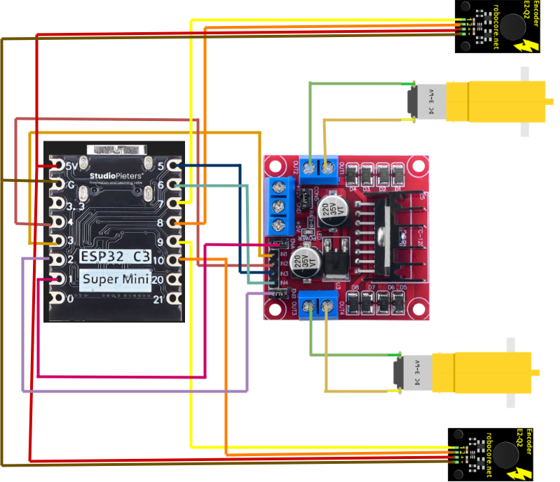

# Semana 2 - Eletrônica e Potência

## Planejamento

🔋 A alimentação do sistema será realizada por duas baterias de 4,5 V conectadas em série, fornecendo uma diferença de potencial total de 9 V. Como essa tensão excede o recomendado para o ESP, será utilizado um conversor step-down (redutor de tensão) embutido na ponte H L298N. Esse dispositivo permitirá reduzir e regular a tensão de alimentação para 5 V, valor adequado para o funcionamento seguro do circuito lógico.

⚡O ESP será responsável pelo envio dos sinais de controle à ponte H por meio de quatro conexões elétricas. A ponte H, por sua vez, acionará os motores do carrinho, permitindo o controle de seu sentido de rotação e de sua velocidade.

Para garantir melhor condução elétrica, será necessário soldar os pinos metálicos ao ESP utilizando solda à base de estanho. Durante esse processo, tomamos cuidado para que a solda de um pino não encostasse na do seu adjacente nem em outros componentes do ESP, pois isso poderia provocar curtos-circuitos e comprometer o funcionamento do sistema.

### Diagrama do circuito

## Fixação dos elementos no chassi
### Ponte H

Antes da instalação da ponte H, o chassi já possuía uma elevação projetada especificamente para seu posicionamento, contendo quatro furos para a fixação por meio de quatro parafusos e quatro porcas. Entretanto, essa elevação entrava em contato com os pinos soldados na parte inferior da ponte H. Para evitar esse contato, foram utilizadas porcas como espaçadores entre a elevação do chassi e a ponte H, mantendo-a ligeiramente elevada. Dessa forma, garantiu-se que nenhum componente da placa encostasse no chassi, evitando possíveis interferências mecânicas ou elétricas que poderiam comprometer seu funcionamento.

### Pilhas

Antes da fixação, foi soldado um fio conectando uma pilha à outra, o que exigia que ambas permanecessem posicionadas lado a lado. Em seguida, as pilhas foram acomodadas ao lado da placa padrão e fixadas ao chassi utilizando cola quente

### Placa Padrão

Assim como ocorreu com a ponte H, o chassi já possuía uma elevação destinada ao posicionamento da placa padrão. Para fixá-la nessa região, foi utilizada cola quente, garantindo sua estabilidade. Sobre a placa padrão, será instalado o ESP, que será encaixado em pinos de suporte (headers), permitindo sua remoção, se necessário.

### Motores, encoders e rodas

Conforme previsto no planejamento do chassi, os motores foram fixados na parte inferior por meio de quatro suportes em formato de **T**, cada um com dois furos para a passagem dos parafusos de fixação. Juntamente com os motores, e voltados para a parte interna do chassi, foram aparafusados os encoders, responsáveis pelo monitoramento da rotação das rodas.

As rodas foram encaixadas diretamente nos eixos dos motores. No entanto, como apresentavam uma pequena folga, foi aplicada fita crepe ao redor dos pinos brancos de encaixe, aumentando o atrito entre as peças. Essa solução proporcionou uma fixação mais firme, reduzindo o risco de as rodas se desprenderem durante o deslocamento do carrinho.

## Pinagem e conexões

### Mapa lógico dos pinos do ESP C3 Mini

| Pino do ESP C3 Mini | Ligação no projeto | Função lógica |
| --- | --- | --- |
| 1 | ENA da ponte H | Habilita o motor A e controla sua velocidade por PWM |
| 2 | ENB da ponte H | Habilita o motor B e controla sua velocidade por PWM |
| 3 | IN1 da ponte H | Define o sentido de rotação do motor A |
| 4 | IN2 da ponte H | Complementa o controle do sentido de rotação do motor A |
| 5 | IN3 da ponte H | Define o sentido de rotação do motor B |
| 6 | IN4 da ponte H | Complementa o controle do sentido de rotação do motor B |
| 7 | Sinal do encoder 1 | Lê os pulsos do encoder 1 |
| 8 | Sinal do encoder 1 | Segundo canal de leitura do encoder 1 |
| 9 | Sinal do encoder 2 | Lê os pulsos do encoder 2 |
| 10 | Sinal do encoder 2 | Segundo canal de leitura do encoder 2 |

### Da ponte H ao ESP

Os pinos ENA e ENB da ponte H foram conectados, respectivamente, aos pinos 1 e 2 do ESP. Da mesma forma, os pinos IN1, IN2, IN3 e IN4 da ponte H foram ligados, respectivamente, aos pinos 3, 4, 5 e 6 do microcontrolador. Essas conexões permitem que o ESP envie os sinais responsáveis pelo controle da velocidade e do sentido de rotação dos motores.

Na ponte H, foram utilizados conectores macho para o encaixe dos jumpers, facilitando a montagem e eventuais manutenções. Já no lado do ESP, os fios foram desencapados e soldados à placa padrão usando estanho.

### Dos motores a ponte H

De cada motor saem dois fios, que já estavam soldados aos seus terminais. Esses fios foram conectados aos bornes de saída da ponte H, localizados nos conectores azuis, onde são fixados por meio do aperto dos parafusos superiores. Os dois fios de cada motor foram ligados ao mesmo canal da ponte H, mantendo cada motor conectado a um lado independente da ponte para possibilitar o controle individual de ambos.

### Dos encoders ao ESP

De cada encoder saem quatro fios: dois destinados à alimentação elétrica, conectados aos terminais de 5 V e GND, e dois responsáveis pela transmissão dos sinais gerados pelo sensor. Os fios de sinal de um dos encoders foram conectados aos pinos 7 e 8 do ESP, enquanto os do outro encoder foram ligados aos pinos 9 e 10. Todas as conexões entre os encoders e o ESP foram realizadas por meio de solda na placa padrão.

## Resultado final

